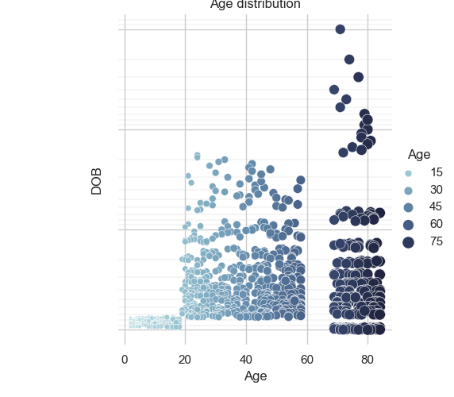
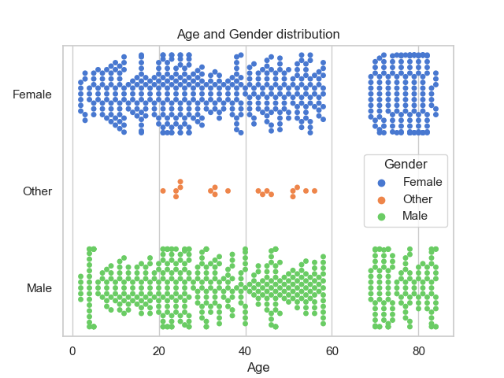
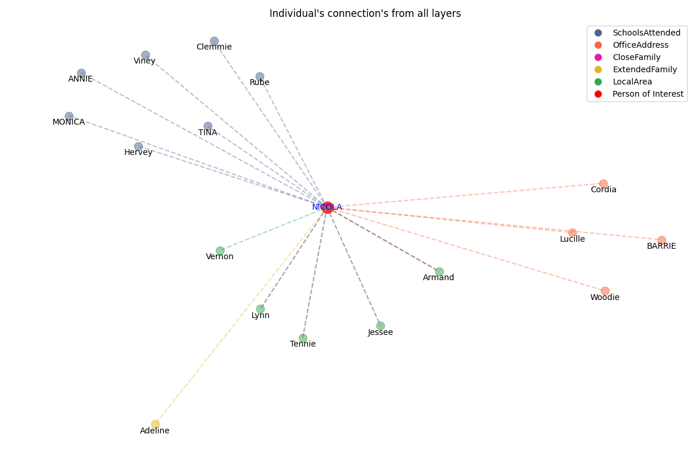

# Country scale simulation of social networks

A simple application to generate large data which represnts the population information. Generate and predict major events in individuals life based HMM.
This application will generate a csv file with basic information about a person. Along with population file it will also generate edges information which can be used in any kind of analysis.

Below are the details captured for each person.
UniqueID: id for each person
FName : First name
Lname : Last name
DOB   : Date of birth in DD-MM-YYYY
Age   : Age
Gender : Gender
FatherName : Fathers full name
MotherName : Mothers full name
SSN	: Social security number
HomeAddress : Home address in format muncipal-sub prefcture- prefecture
EducationLevel : Education
MaritalStatus : Marital status
SpouseName : Spouse name
HasChildren : Boolean 
NumOfChild : Count
ChildrenNames : All children names seperated by /
SchoolsAttended:All schools names person went to seperated by /
IsEmployed  : Boolean True/False
OfficeAddress	: All office address person went to seperated by /
FatherIndexinDB	: Row index in population_database.csv file, -1 if father is unknown
MotherIndexinDB : Row index in population_database.csv file, -1 if mother is unknown
Events_info: Major life events captured in multiple columns

Below is the details of columns in family_edges.csv:
conn_from : UniqueID of person
conn_to  : UniqueID of person
edge_type : Any one of these values [ 'grand child', 'aunt', 'uncle', 'grand father','grand mother', 'sister', 'brother', 'nephew', 'niece', 'husband', 'wife' , 'father', 'mother']

Major events are predicted based on fixed HMM model. User can also train this model to get better prediction of future events in persons life.

## Installation

To build the code CMAKE is required [https://github.com/Kitware/CMake/blob/master/README.rst].
1. Extract package to folder
   -> Country-scale-simulation-of-social-networks-main
2. cd Country-scale-simulation-of-social-networks-main
3. Create directory build.
   mkdir build
   cd build
4. cmake ..
5. make

## Usage

From build directory.
 ./COUNTRY_SCALE_SIM arg1 arg2

 arg1 : 'data' folder path where all ini file and other inputs are present.
 arg2 : 1 or 0. 1: Generate family tree. 0: Do not generate family tree.

## Simple Analysis 
After generating population data and family edges. Used python script to perform below analysis.

## Contributing

1. Fork it!
2. Create your feature branch: `git checkout -b my-new-feature`
3. Commit your changes: `git commit -am 'Add some feature'`
4. Push to the branch: `git push origin my-new-feature`
5. Submit a pull request

## History

## Credits

## License

TODO: Write license